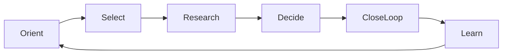
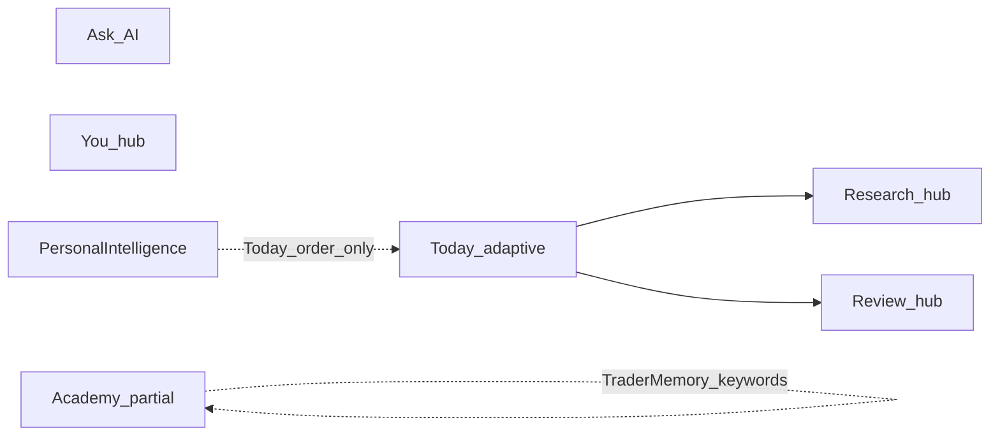

# TradeVision AI — Product Redesign Specification

**Status:** Spec freeze (R0)  
**Scope:** Experience / information architecture / product narrative — **not** a visual rebrand  
**Baseline:** Post–Phase 6 (`4fe624f` era) — ops platform, AI trust, Personal Intelligence, native reliability paths shipped  
**Design system:** Preserve dark teal tokens in `shared/constants/theme.ts` (tighten density/motion only; no cream/serif/purple pivot)  
**Visual excellence pass:** [PHASE_A_PRODUCT_EXCELLENCE.md](./PHASE_A_PRODUCT_EXCELLENCE.md) (calm chrome, primitives, hub/Today hierarchy)  
**AI credibility pass:** [PHASE_B_AI_TRUST_CENTER.md](./PHASE_B_AI_TRUST_CENTER.md) (Trust Center on every answer)

This document is the product contract for the next implementation phases. It does not authorize brokerage, signals, P&L gamification, or a third subscription tier.

---

## 1. Product thesis and non-negotiables

### Thesis

TradeVision AI helps discretionary traders answer one question well:

> **Should I spend time researching this — and if I do, did I decide with a complete process?**

It is a **decision-first research and coaching** product. It is not a charting terminal clone, not a broker, and not a tip service.

### Mission (user-facing)

Helping traders make better decisions through education, research, and disciplined practice.

### Non-negotiables

| Do | Don’t |
|----|--------|
| Rank **research worth** and grade **process quality** | Predict price direction or issue buy/sell signals |
| Celebrate skips, invalidation discipline, journal close-loop | Celebrate P&L, win rates, or “hero trades” |
| Honest data badges (`live` / `delayed` / `approximate` / `sample` / `mock`) | Fabricate FX candles or silent degradation |
| Educational Mode + AI trust chrome on analysis surfaces | Black-box AI as Premium’s identity |
| Opt-in analytics/crash; allowlisted events only | Journal text, AI prompts, or portfolio values in analytics |
| Guest/demo when Firebase is absent (`demo-guest`) | Assume cloud is always available |
| Capability-aware alert copy (Expo Go vs Dev Client) | Claim instant background alerts in store copy before field proof |

### Score glossary (canonical)

Source of truth: `shared/constants/trust-language.ts`.

| Term | Meaning |
|------|---------|
| **RVS** (Research Value Score) | How worthwhile this is to research *now* |
| **DQS** (Decision Quality Score) | How complete the decision process / evidence checklist is |
| **Technical bias** | Description of indicator state — not a forecast |
| **Output quality** | Evidence coverage / consistency — not probability of a move |

**Copy rule:** Scores never imply directional certainty. Prefer “research priority” and “process completeness” over “confidence” when user-facing space allows.

---

## 2. Jobs-to-be-done and primary loop

### Primary daily loop

Redesign the product around **one loop**, not a tool directory:

| Job | User intent | Primary surfaces |
|-----|-------------|------------------|
| **Orient** | What’s the session brief and time budget? | Today (hero + day plan) |
| **Select** | Which idea deserves attention? | Today Start Here / queue strip; Research → Setups |
| **Research** | Gather evidence within budget | Asset / analysis; regime & portfolio risk as context |
| **Decide** | Engage, skip, or wait — with reason | Why-Not, journal prompt, alerts on invalidation |
| **Close loop** | Record the process outcome | Journal, Decision Log, Process Tape |
| **Learn** | Strengthen weak process traits | Academy (Skill OS), Replay, Lab, Trading DNA / Growth |

### Secondary jobs (never steal first viewport)

- Manage desk: Portfolio, Alerts, Calendar, Settings  
- Explain: Ask AI (trust-first)  
- Account: Subscription, privacy, accessibility  

---

## 3. Current-state diagnosis

### What already works

- Clear educational positioning and trust language foundations  
- Decision OS services (RVS/DQS, fatigue/debt, mentor, explainability)  
- Phase 2 AI trust panels (evidence, counterfactuals, why-changed)  
- Phase 3 Personal Intelligence (DNA, graph, Dynamic Today ordering)  
- Phase 5 ops flags / consent analytics / kill switches  
- Phase 6 Dev Client path for background alerts, IAP, production push  

### Structural gaps this redesign closes

1. **Feature density on Today** — many sections compete in the first session (`today-sections.service.ts` order can surface hero + mentor + goals + DNA + Start Here + queue + …).  
2. **Hubs as directories** — Research / Review / You are flat link grids (`navigation-ia.config.ts`), not curated paths.  
3. **Academy under-wired to PI** — personalized curriculum uses Trader Memory keyword strings (`curriculum.service.ts`), not Phase 3 continuous DNA traits.  
4. **Alerts at parity** — delivery reliability in progress; **invalidation-linked** alerts (differentiator) not designed into the loop.  
5. **Glanceable decision** — home-screen widget not specified (Phase 6.5).  
6. **Premium narrative drift risk** — free/premium + usage AI is correct; packaging must keep selling **process depth**, not “cloud AI.”

**Target:** PI and Academy become the same growth spine; hubs become paths; Today becomes one session.

---

## 4. Target information architecture

### Tab shell (keep five tabs — low migration cost)

| Tab | Job (redesign) | Principle |
|-----|----------------|-----------|
| **Today** | One decision session | Hero + one primary CTA + ≤1 secondary; rest progressive disclosure |
| **Research** | Find what deserves time | Setups first-class; Markets / market condition / portfolio risk as **context**, not peers |
| **Review** | Improve process | Process Tape default; Lab / Heatmap / Passport / Learn as **modes** |
| **Ask** | Explain / coach | Trust chrome default-visible; ops-flag gated |
| **You** | Identity + desk | Split into **Growth** vs **Desk** sections |

### Glossary and naming

| Internal / current | User-facing (redesign) |
|--------------------|-------------------------|
| Personal Intelligence | **Trading DNA** (deep) / **Growth** (hub section) |
| Learn / Academy | **Learn** (tab entry) — Skill OS in product copy |
| Setups / Radar | **Setups** |
| Process Tape | **Process Tape** (Review default) |
| Decision Lab | **Decision Lab** |
| Ask | **Ask** |

Avoid “Personal Intelligence” in primary nav labels; keep route `/decision/intelligence` if needed for deep links.

### Hub pattern: curated paths (not flat grids)

Every hub section uses three path types:

1. **Start** — first action for this job today  
2. **Continue** — unfinished debt (journal, replay, lesson)  
3. **Deepen** — advanced / practice tools  

Example — Research:

- Start → Setups (queue)  
- Continue → last open symbol / unfinished research note  
- Deepen → Markets, Market condition, Portfolio risk  

Example — Review:

- Start → Process Tape  
- Continue → incomplete journal / unfinished replay  
- Deepen → Heatmap, Decision Lab, Learn, Strategy sandbox  

Example — You:

- **Growth:** Trading DNA, Passport, Learn, Mentor references  
- **Desk:** Portfolio, Alerts, Calendar  
- **Account:** Settings, Subscription  

---

## 5. Surface redesign briefs

Each brief: purpose, first viewport, primary CTA, empty/error, premium, trust.

### 5.1 Today

**Purpose:** Run one decision session inside the user’s time budget.

**First viewport (only):**

1. Brand-adjacent product mark / Today title (existing header pattern)  
2. **Dynamic Today hero** — one sentence focus from archetype (“Protect attention” / “One lesson then stop” / “Replay before new risk”)  
3. **Primary CTA** — Start Here (top setup) *or* Day plan “begin session” if no A+ setup  
4. **Optional secondary** — single text link: “Why not research anything” / open Why-Not  

**Below fold (progressive):**

- Compact queue strip (top 1–3 free / deeper premium)  
- Close-loop prompt if debt exists (journal / replay)  
- Mentor, adaptive goals, DNA pulse — **collapsed** or linked to Growth (“See Trading DNA”)

**Do not** stack mentor + goals + DNA + full regime + full log above the fold.

**Empty:** No setups meeting criteria → hero says stop; CTA = journal yesterday / one Academy lesson / Process Tape.  
**Error:** `RecoverableErrorState` what / why / recover (already patterned).  
**Premium:** Core loop always visible; queue depth and DNA detail upgrade in place — never hide Orient/Select.  
**Trust:** Educational Mode badge retained; brief explainability stays factual, not predictive.

**Implementation anchors:** `app/(tabs)/index.tsx`, `today-sections.service.ts`, `personalized-today.service.ts`.

### 5.2 Research → Setups (first-class)

**Purpose:** Rank ideas by RVS; choose research vs skip.

**First viewport:** Queue list with RVS, regime fit, time cost — not a markets search box.  
**Primary CTA:** Open top setup / Start research.  
**Context entry points:** Markets, Market condition, Portfolio risk as secondary rows or sheet.  
**Trust:** RVS explainer one tap away; Non-prediction copy on score info.

### 5.3 Asset / analysis

**Purpose:** Evidence gathering within budget — then decide.

**First viewport:** Chart + session checklist (invalidation, time stop, what would change mind).  
**Primary CTA:** Log decision (research / skip / wait) — not “trade.”  
**Trust:** DataSourceBadge + Educational Insight footer; AI panels show evidence by default when analysis runs.

### 5.4 Review → Process Tape (default)

**Purpose:** Improve process from recorded decisions.

**First viewport:** Timeline of researched / skipped / journaled — process scores, never P&L.  
**Modes:** Chart Replay, Journal, Heatmap, Decision Lab, Learn, Strategy sandbox.  
**Primary CTA:** Continue unfinished tape item or “Review yesterday.”

### 5.5 Ask

**Purpose:** Explain process and evidence; coach psychology without signals.

**First viewport:**

- Prompt input + 2–3 process suggestions  
- Latest reply with **Why / evidence / what would change** expanded by default on first session (or until dismissed once)  
- Memory insight card (privacy-safe traits)

**Gating:** `aiChatEnabled` + usage tier limits; `globalKill` fails closed with honest empty state.  
**Trust:** Disclaimers always; never hide trust behind “Advanced.”

### 5.6 You → Growth vs Desk

**Growth first viewport:** Trading DNA snapshot (becoming label + 2 growth edges) → CTA “Continue Learn” (Skill OS next lesson).  
**Desk:** Portfolio, Alerts, Calendar.  
**Account:** Settings, Subscription.

User-facing “Personal Intelligence” screen remains the DNA deep dive; entry label = **Trading DNA**.

### 5.7 Academy as Skill OS (priority redesign)

**Purpose:** Turn weak process traits into the next lesson/practice — the app’s skill operating system.

**Inputs (reuse, no new event store):**

- Phase 3 DNA trait scores + growth edges (`features/personal-intelligence/`)  
- Decision debt (journal / replay / unreviewed)  
- Existing lesson map in `curriculum.service.ts` (extend from traits, don’t fork)

**Behavior:**

| Signal | Recommendation bias |
|--------|---------------------|
| Low patience / high overtrading debt | Why-Not / time-budget lessons |
| Low journal follow-through | Journaling lesson + close-loop CTA |
| Low risk / Lab debt | Risk expectancy / Lab challenge |
| New trader archetype | Decision Operator path first |
| High consistency | Advanced setup quality / regime |

**Write-back:** Lesson complete / checklist complete already feed Passport counters and can refresh adaptive goals — do **not** invent a parallel progress DB.

**Premium:** Personalized next-lesson engine remains Premium; free users get Decision Operator default path (current pattern) with clear upgrade for “lessons matched to your DNA.”

**First viewport:** Next lesson card (reason + evidence chips: “From Trading DNA · patience”) + path progress.  
**Primary CTA:** Start recommended lesson.

### 5.8 Alerts 2.0 — invalidation-linked (after Phase 6 field proof)

**Purpose:** Differentiator vs generic price alerts — protect the thesis, not chase ticks.

**Model:**

- Alert binds to a **setup / research record** + **invalidation level** + optional note  
- On fire: local/push notification → deep link to setup card + **Why-Not** / decide flow  
- Copy: “Invalidation reached — review thesis” — never “buy/sell now”

**Delivery:** Inherits Phase 6 background evaluation + capability-aware UX. Server-side evaluator remains a reliability follow-up if OS scheduling miss-rates are high (`docs/DEV_BUILD.md`).

**Out of scope until R3:** Multi-condition alert builders beyond invalidation+price.

### 5.9 Glance widget (R4 / Phase 6.5)

**Purpose:** Orient without opening a terminal.

**Content (process only):**

- Today headline (one line)  
- Top setup symbol + RVS (or “No A+ setups — protect attention”)  
- Time budget remaining  

**Never:** P&L, portfolio value, directional arrows as “signals.”

Requires Dev Client / production build (same native track as Phase 6).

### 5.10 Decision Passport (constraints)

Achievements stay **process-only**. Current defs (journals, replays, disciplined passes, patience, checklist streak, risk process, simulator process, heatmap consistency, Academy lessons) remain the template.  

**Forbidden:** profit badges, win-rate trophies, social leaderboards.

---

## 6. Navigation and content hierarchy rules

1. **One job per section** — one headline, one short support line, one primary action.  
2. **First viewport ≠ dashboard** — no stat strips, pill clusters, or competing cards above the fold on Today.  
3. **Cards only for interaction containers** — if removing chrome doesn’t hurt understanding, remove it.  
4. **Progressive disclosure** — Mentor / DNA / goals live below fold or in Growth.  
5. **Hubs are paths** — Start / Continue / Deepen.  
6. **Data honesty** — every market figure carries source/freshness affordance.  
7. **Motion** — respect Reduce Motion; use shared `motion` helpers; 2–3 intentional motions max per key surface.  
8. **Accessibility** — retain Phase 4 patterns (announcements, labels, Dynamic Type via shared Text).

---

## 7. Monetization and packaging

### Tiers (unchanged shape)

`free | premium` only — monthly + yearly products; no lifetime SKU; no Pro tier revival.

### Value split

| | Free | Premium |
|---|------|---------|
| Today loop | Full Orient → Select → Decide → Close loop | Same |
| Research queue | Top three | Full queue + depth |
| Journal / basic Review | Yes | + advanced Process Tape insights |
| Ask | Limited daily fair-use | Higher fair-use (not “unlimited”) |
| Trading DNA | Pulse / teaser | Full DNA, graph, evolution |
| Academy | Default Operator path | DNA-matched Skill OS recommendations |
| Decision Lab / export / portfolio intelligence | Limited or locked per current gates | Unlocked |

### Paywall copy checklist

- Lead with: deeper queue, DNA, Lab, review depth, fair-use Ask  
- Never lead with: “cloud AI predictions,” guaranteed edge, brokerage features  
- Keep trial messaging aligned with `YEARLY_TRIAL_DAYS`  
- Store screenshots show process loop, not candlestick theater alone  

---

## 8. Ops, flags, and rollout

Reuse Phase 5 flags (`features/ops-config`); ship redesign dark where needed:

| Flag | Redesign use |
|------|----------------|
| `personalIntelligenceEnabled` | Growth / DNA surfaces |
| `academyEnabled` | Learn / Skill OS |
| `aiChatEnabled` / `aiTrustPanelsEnabled` | Ask + trust chrome |
| `mentorEnabled` | Mentor card |
| `decisionGraphEnabled` | DNA deep dive graph |
| `globalKill` | Fail closed on Ask / high-risk; keep Today + journal |

Rollout: percentage / beta channels via Ops Admin after R1–R2 land.  
Alert capability copy remains build-aware (Expo Go vs Dev Client).

---

## 9. Phased delivery map

| Release | Focus | Outcome |
|---------|--------|---------|
| **R0** | Spec freeze | This document |
| **R1** | Today compression + hub path labels | First viewport = one session; hubs = Start/Continue/Deepen |
| **R2** | Academy ↔ PI wiring | Skill OS recommendations from Phase 3 DNA + debt |
| **R3** | Invalidation-linked alerts | Alert → setup + Why-Not; inherits Phase 6 delivery |
| **R4** | Widget + store glance narrative | Process glance on home screen; store copy only after proof |
| **R5** | Visual polish within tokens | Density, empty states, motion — **not** rebrand |

**Dependency:** R3 assumes Phase 6 device verification checklist is complete for background delivery claims.

**Suggested sequencing after R0:** R1 → R2 in parallel with field QA for Phase 6 → R3 → R4 → R5.

---

## 10. Success metrics and anti-metrics

### Product metrics (consent-gated, allowlisted only)

| Metric | Intent |
|--------|--------|
| Start Here completion rate | Orient → Select works |
| Skip-with-reason rate | Decide quality, not forced trades |
| Journal close-loop % within 24h | Close loop |
| Academy lesson started from DNA recommendation | Skill OS adoption |
| Alert open → Why-Not / setup deep link | Alerts 2.0 value |
| Process Tape session weekly | Review habit |

### Anti-metrics (watch and discourage)

- Chart time without a logged decide/skip  
- Engagement driven by simulated or real P&L framing  
- Ask sessions with zero trust-panel interaction in first week  
- Hub bounce (open Research → leave without Setups)  

Analytics must stay on the allowlist (`shared/services/analytics/events.ts`); extend events only with privacy review.

---

## 11. Explicit non-goals

- Brokerage, order routing, or exchange connectivity  
- Social leaderboards or profit badges  
- TradingView-style multi-tier SKU ladder  
- Lifetime purchase SKU  
- Visual rebrand / new brand palette  
- Redesigning alert *price rules* beyond invalidation linkage (R3)  
- Replacing RevenueCat webhook authority  
- Fabricating live market data for polish  

---

## 12. Risks and open engineering notes

| Risk | Mitigation |
|------|------------|
| Today compression feels like “removed features” | Progressive disclosure + Growth links; flags for gradual rollout |
| DNA → Academy mapping is coarse | Start with growth-edge → existing `WEAKNESS_LESSON_MAP`; iterate with content tags |
| Background alerts still miss on some OEMs | Capability copy + server evaluator follow-up |
| Widget review guidelines | Process-only content; no advice claims |
| Spec drift vs store marketing | Store claims gated on Phase 6 + R3/R4 verification |

### Key code anchors (for implementers)

| Area | Path |
|------|------|
| Tab IA | `features/navigation/config/navigation-ia.config.ts` |
| Today sections | `features/decision/services/today-sections.service.ts` |
| Personalized Today | `features/personal-intelligence/services/personalized-today.service.ts` |
| Academy recommendations | `features/academy/services/curriculum.service.ts` |
| Trust language | `shared/constants/trust-language.ts` |
| Tiers | `shared/constants/subscription.ts` |
| Ops flags | `features/ops-config/defaults.ts` |
| Alerts capability | `features/alerts/services/alert-capability.service.ts` |
| Passport achievements | `features/decision-passport/services/passport-achievements.service.ts` |
| Native reliability | `docs/DEV_BUILD.md`, `docs/PHASE6_NATIVE_RELIABILITY_REPORT.md` |

---

## 13. Approval

| Role | Sign-off meaning |
|------|------------------|
| Product | Thesis, IA, packaging, metrics accepted |
| Design | First-viewport rules + hub paths accepted (within existing tokens) |
| Engineering | Phased map + anchors feasible on Expo SDK 54 |
| Store / compliance | Educational + non-prediction claims retained |

**R0 complete when this file is merged.** Implementation begins only on explicit R1+ requests.
